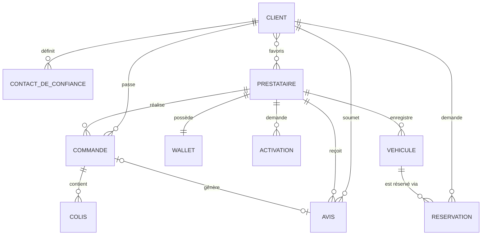
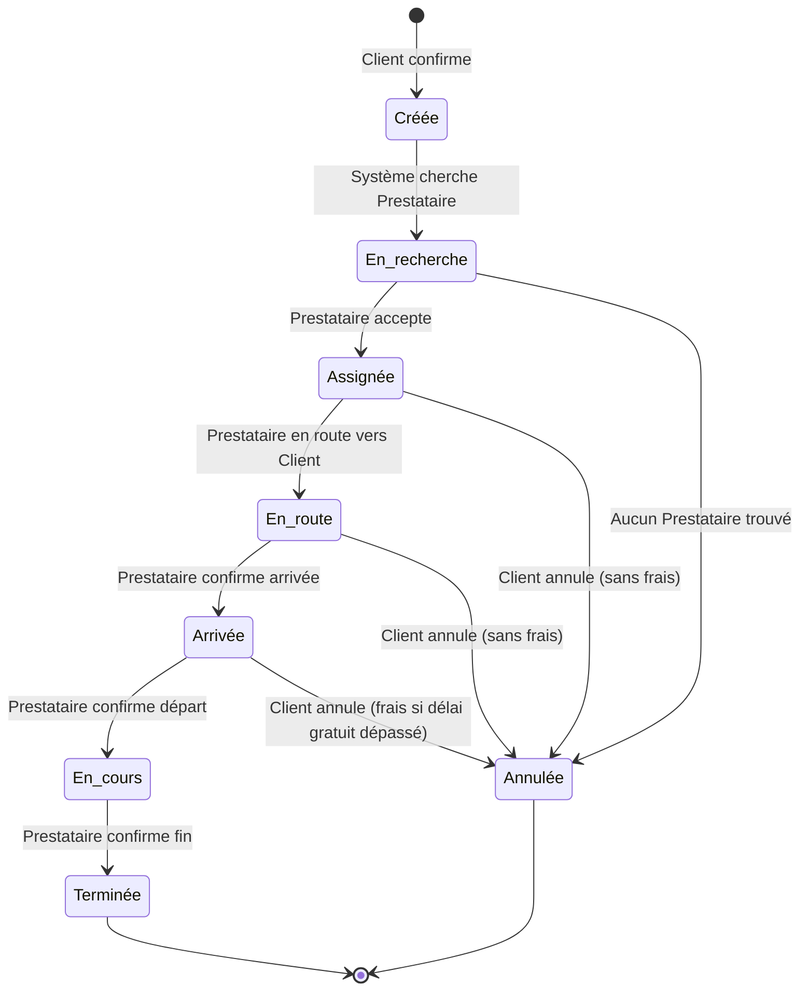
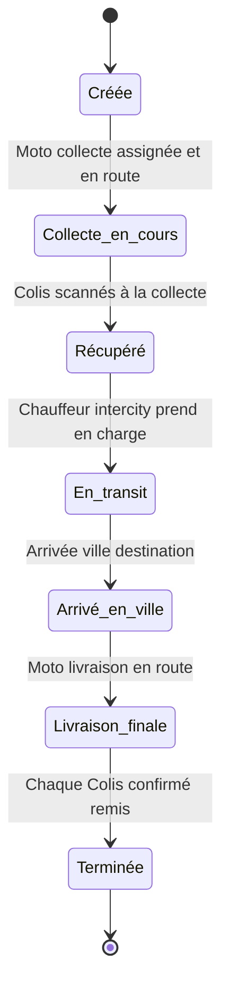
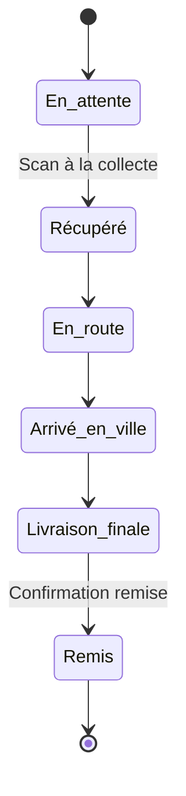
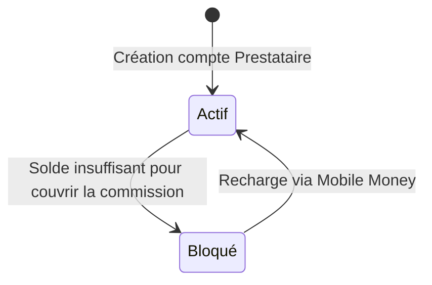
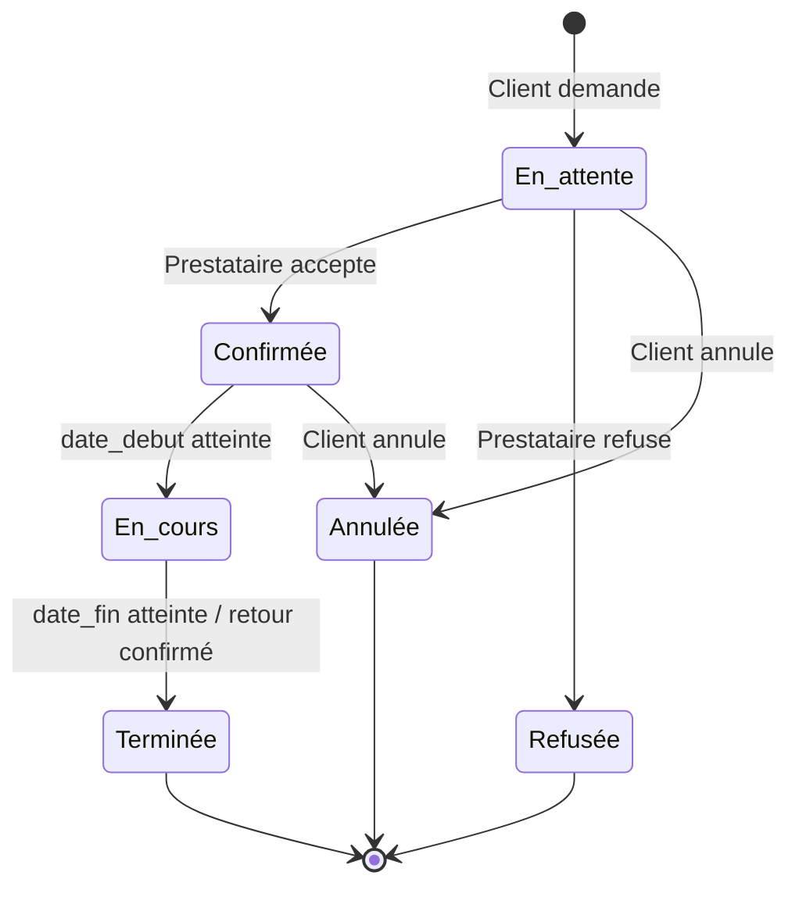
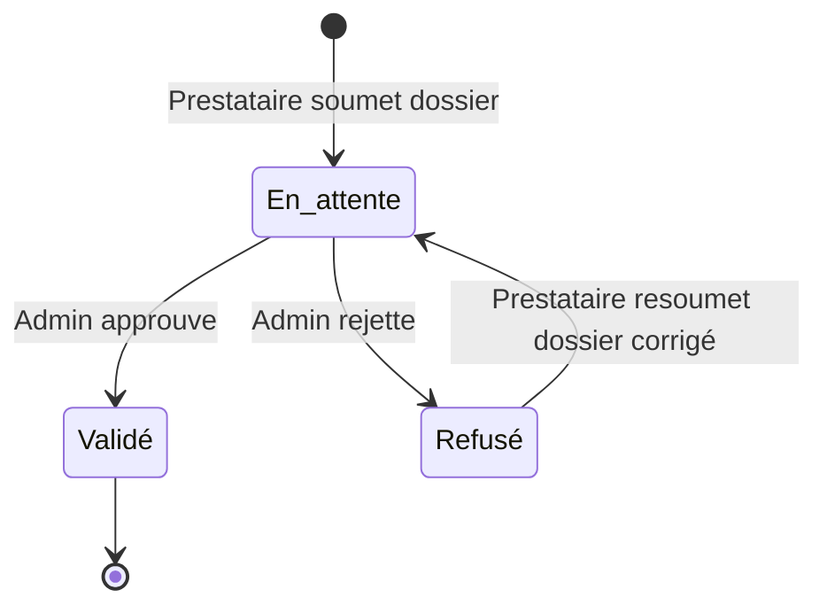

# Fiw — Modèle conceptuel

> Référence de conception pour la phase UX/UI. Définit les objets que le produit reconnaît, leurs relations, leurs états et les actions possibles — indépendamment de toute interface.
>
> **PROVISIONAL** = hypothèse non validée par un flux ou une recherche. Ne pas stabiliser ni construire dessus avant test.

---

## Objets

### Commande
Entité centrale du produit. Une demande émise par un Client pour un service, assignée à un ou plusieurs Prestataires, avec un cycle de vie de la création à la clôture.

**Vocabulaire UI :** « Course » dans Fiw, « Mission » dans Fiw Pro. `Commande` est le terme canonique interne (APIs, base de données, engineering).

**Attributs communs :** id, type, statut, prix_estimé, prix_final, mode_paiement, frais_rapprochement (nullable), frais_attente (nullable), created_at, scheduled_at (nullable), cancelled_at (nullable)

**Types et attributs étendus :**

| Type | Attributs spécifiques |
|---|---|
| `transport_voiture` | gamme (Économique / Confort / Prestige), origin, destination |
| `transport_moto` | origin, destination |
| `velo_express` | colis[], livraison_groupée (bool) |
| `moto_livraison` | colis[], livraison_groupée (bool) |
| `yobante` | tracking_number (YOB-AAAAMMJJ-XXX), legs[], colis[], prestataires[] |
| `assistance` | type_problème (Dépanneuse / Batterie / Pneu / Carburant / Mécanique) |
| `covoiturage` | origin, destination, nombre_passagers |

**Note :** `yobante` (multi-Prestataires, multi-legs, tracking propre) casse partiellement le schéma commun. Voir décisions ouvertes.

> **Décision (juin 2026) :** Location Longue Durée n'est **pas** un type de Commande. Pas de dispatch live, pas de Prestataire assigné dynamiquement, états sans rapport avec le cycle de vie standard d'une Commande (pas de En_recherche / Assignée). Modélisée comme objet `Réservation` distinct — voir plus bas. Décision prise en travaillant la sitemap (séparation Historique / Mes réservations).

**Actions :** Créer, Planifier (scheduled_at), Annuler (Client), Accepter (Prestataire), Refuser (Prestataire), Confirmer arrivée, Confirmer départ, Terminer, Évaluer (après Terminée)

---

### Client
Personne physique utilisant Fiw pour commander un service.

**Attributs :** id (CLI-XXXX), prénom, nom, téléphone, photo, points_fidélité, niveau_fidélité

**Rôles additionnels activables :** AffiliéRéseau, AffiliéPartenaire *(PROVISIONAL)*

**Actions :** S'inscrire, Se connecter, Commander, Planifier, Annuler, Évaluer un Prestataire, Ajouter un Contact de confiance, Déclencher SOS, Partager trajet, Activer affiliation, Consulter historique, Convertir points

---

### Prestataire
Personne physique inscrite sur Fiw Pro pour fournir un ou plusieurs services.

**Attributs :** prénom, nom, téléphone, photo, note_moyenne (publique), score_coopération (interne, invisible du Prestataire), statut (Bronze / Argent / Or / Diamant)

**Identifiants :** un ID par service validé (VEL-XXXX / MOT-XXXX / AUT-XXXX)

**Relations :** possède un Wallet, a des Activations (une par service), enregistre des Véhicules

**Actions :** S'inscrire, Demander une Activation, Basculer En ligne / Hors ligne, Accepter / Refuser une Commande, Confirmer arrivée, Confirmer départ, Terminer mission, Évaluer Client (privé), Recharger Wallet, Définir Direction programmée, Recruter (si AffiliéRéseau)

---

### Activation
L'inscription d'un Prestataire à un service spécifique. Objet à part entière : cycle de vie propre, documents propres, identifiant propre.

**Attributs :** service_type, statut (En attente / Validé / Refusé), id_service (VEL/MOT/AUT-XXXX), documents[]

**Cardinalité :** 1 Prestataire → N Activations (une par service cumulable)

**Actions :** Demander, Soumettre documents, Valider (admin), Refuser (admin), Mettre à jour documents (en cas d'expiration)

---

### Wallet
Compte virtuel d'un Prestataire. Sert exclusivement à payer la commission Fiw (14 % par Commande terminée). Wallet vide = accès bloqué.

**Attributs :** solde, statut (actif / bloqué)

**Cardinalité :** 1 Prestataire → 1 Wallet

**Actions :** Recharger (via Mobile Money), Consulter solde, Consulter historique (crédits = recharges, débits = commissions)

---

### Colis
Objet physique à livrer dans le cadre d'une Commande livraison ou Yobanté.

**Attributs :** description, tracking_number (YOB-… pour Yobanté, nullable sinon), statut

**Cardinalité :** 1 Commande → N Colis (minimum 1)

**Actions :** Scanner à la collecte, Confirmer remise

---

### Contact de confiance
Personne désignée par un Client pour recevoir les notifications de sécurité et les liens de suivi de trajet.

**Attributs :** nom, téléphone, notification_auto (bool)

**Cardinalité :** 1 Client → N Contacts de confiance

**Actions :** Ajouter, Modifier, Supprimer, Recevoir notification départ, Recevoir lien trajet live, Recevoir alerte SOS (GPS + urgences)

---

### Avis
Évaluation publique émise par un Client sur un Prestataire, associée à une Commande terminée.

**Attributs :** étoiles (1–5), commentaire (nullable), visibilité (publique)

**Distinct de l'ÉvaluationClient** — note donnée par le Prestataire sur le Client, interne et privée, non exposée.

**Cardinalité :** 1 Commande → 0 ou 1 Avis (par le Client)

**Actions :** Soumettre (uniquement après statut Terminée)

---

### Véhicule
Véhicule enregistré par un Prestataire — utilisé pour ses missions ou proposé à la location longue durée.

**Attributs :** type, immatriculation, documents (permis, assurance, carte grise, visite technique), disponible_location (bool)

**Actions :** Enregistrer, Mettre à jour documents, Proposer à la location, Retirer de la location

---

### Réservation
Demande de location longue durée d'une ressource (Véhicule ou Parking) appartenant à un Prestataire, pour une durée définie. Distincte de Commande : pas de dispatch live, pas de Prestataire assigné dynamiquement — logique de disponibilité et de créneau, pas de tracking GPS en temps réel.

**Attributs :** id, ressource_type (Véhicule / Parking), ressource_id, date_debut, date_fin, statut (En attente / Confirmée / En cours / Terminée), prix

**Cardinalité :** 1 Client → N Réservations ; 1 Véhicule ou Parking → N Réservations (créneaux non superposés)

**Actions :** Demander, Accepter (Prestataire), Refuser (Prestataire), Proposer ajustement (Prestataire), Annuler (Client), Prolonger (Client)

**Note IA :** vit dans une place dédiée (« Mes réservations », sous la branche Location Longue Durée) — pas dans l'Historique global des Commandes, qui se contente d'un lien vers cette place plutôt que d'afficher les réservations comme des lignes.

---

### AffiliéRéseau
Rôle activé par un Client ou un Prestataire depuis leur application respective. Permet de recruter d'autres clients et prestataires, et de percevoir 2 % de commission sur les Commandes générées. Ces commissions s'accumulent dans les **Gains** — réserve propre à l'affilié, **encaissable via Mobile Money uniquement**, jamais dépensable in-app (l'usage in-app de la valeur reste propre aux Points Fidélité).

**Attributs :** Solde des Gains (montant retirable), historique des mouvements (crédits = commissions perçues, débits = retraits)

**Actions :** Recruter, Retirer (Gains → Mobile Money — soumis à un seuil minimum de retrait *à définir par Blaise & Daniel*)

**Modèle de données :** flag + dashboard sur le compte Client/Prestataire existant — pas d'entité propre, pas de relations supplémentaires à modéliser. Les Gains sont une réserve scalaire (solde + journal de mouvements) portée par le compte, pas un objet distinct. *Décidé en travaillant la sitemap : la bannière d'affiliation reste à l'intérieur du compte existant. Retrait cash via Mobile Money = **modèle cible (long terme)**, acté au meeting client du 27 juin 2026. **Au démarrage**, le paiement sera vraisemblablement **différé** (commissions comptabilisées sans versement, phase « Partenaire Fondateur ») ; la date de bascule vers le retrait ouvert est une décision Blaise & Daniel, à définir.*

---

### AffiliéPartenaire
Entité représentant une entreprise ou un commerce (restaurant, hôtel, agence…) qui génère des Commandes depuis un point physique et perçoit 4 % de commission.

**Modèle de données :** entité distincte, pas un rôle sur un compte Client — une entreprise n'est pas une personne physique et peut avoir plusieurs membres accédant au même tableau de bord. *Décidé en travaillant la sitemap : reste dans l'écosystème Fiw (pas d'app séparée) mais avec son propre contexte de connexion/compte — implique des relations propres (membres, succursales) à modéliser avec l'engineering avant le breadboard du flux.*

---

## Object map

---

## Machines d'état

### Commande (standard — transport, livraison, assistance)

> Le Prestataire peut refuser ou annuler à tout moment — cela affecte son score de coopération mais ne génère pas de frais. Le score de coopération est interne et invisible du Prestataire.

> Frais d'attente : déclenchés automatiquement par GPS dès l'arrivée du Prestataire, après le délai gratuit (3 min si Commande ≤ 1 000 F CFA, 5 min si > 1 000 F CFA). 100 F CFA/minute.

---

### Commande Yobanté (legs séquentiels)

> Chaque leg est géré par un Prestataire distinct. Le Client paie une fois ; l'app distribue aux Prestataires. Le tracking_number (YOB-…) est généré à la création.

---

### Colis (dans Yobanté)

---

### Wallet

---

### Réservation

---

### Activation (Prestataire → service)

---

## Inventaire d'actions (CTA)

| Action | Objet cible | Acteur | Remarques |
|---|---|---|---|
| Commander | Commande | Client | Point d'entrée principal des deux apps |
| Planifier | Commande | Client | `scheduled_at` obligatoire |
| Annuler | Commande | Client | Frais selon état (voir machine d'état) |
| Accepter | Commande | Prestataire | Timer d'acceptation en cours |
| Refuser | Commande | Prestataire | Affecte score de coopération |
| Confirmer arrivée | Commande | Prestataire | Déclenche compteur frais d'attente |
| Confirmer départ | Commande | Prestataire | Clôt la zone d'annulation gratuite |
| Terminer | Commande | Prestataire | Déclenche prélèvement commission (14 %) |
| Évaluer | Avis | Client | Disponible uniquement après Terminée |
| Évaluer (privé) | ÉvaluationClient | Prestataire | Interne, non exposée côté Client |
| Recharger | Wallet | Prestataire | Via Mobile Money |
| Demander activation | Activation | Prestataire | Par service, cumulable |
| Ajouter contact | Contact de confiance | Client | |
| Déclencher SOS | — | Client, Prestataire | GPS envoyé aux contacts + urgences |
| Partager trajet | — | Client | Lien vers position live du Prestataire |
| Recruter | AffiliéRéseau | Client, Prestataire | Rôle sur le compte existant |
| Retirer | Gains | AffiliéRéseau | Vers Mobile Money · seuil minimum de retrait à définir (Blaise & Daniel) |
| Demander | Réservation | Client | Pas de dispatch live — distinct de Commander |
| Accepter / Refuser | Réservation | Prestataire | |
| Proposer ajustement | Réservation | Prestataire | Ex. dates alternatives |
| Prolonger | Réservation | Client | |

---

## Décisions ouvertes

| Décision | Enjeu | Recommandation |
|---|---|---|
| **Yobanté comme sous-type ou objet distinct** | Multi-Prestataires, legs séquentiels, et tracking propre cassent partiellement le schéma Commande standard | Conserver comme type `yobante` dans Commande mais avec schéma étendu ; revisiter si l'engineering constate trop de cas particuliers |
| **AffiliéPartenaire — relations à modéliser** | Entité distincte décidée (voir section AffiliéPartenaire), mais membres/succursales pas encore modélisés | À breadboarder avec l'engineering avant le flux d'affiliation Partenaire |
| **ÉvaluationClient** | Invisible côté UI mais doit exister dans le modèle de données pour alimenter le score de coopération | À modéliser explicitement avec l'engineering pour éviter qu'elle soit traitée comme un Avis |
